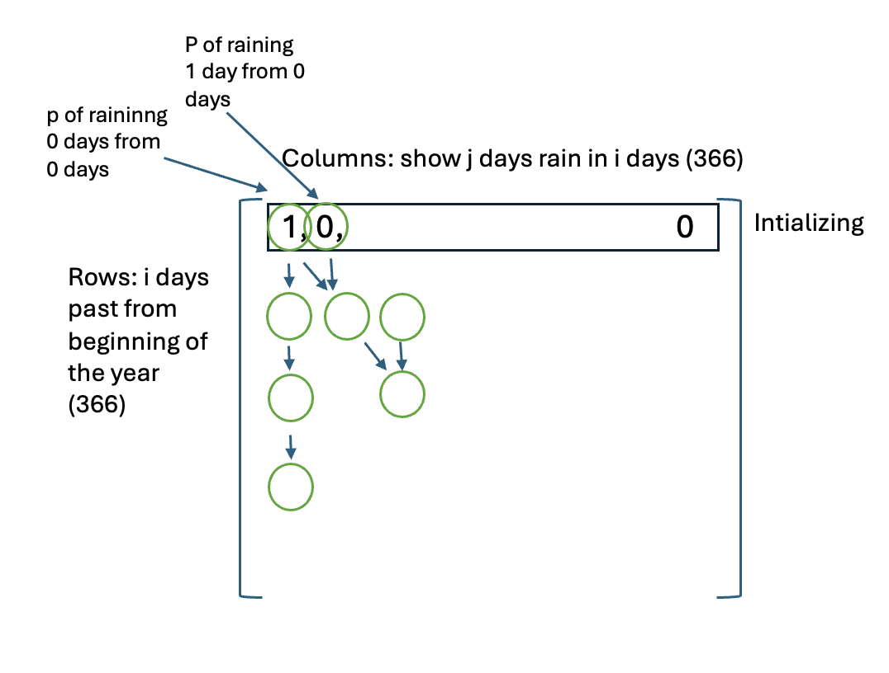

## Calculating the Probability of Raining More Than \( n \) Days

To calculate the probability of it raining more than $n$ days, given the probability of rain for each day, a **brute force** approach involves using the **Poisson binomial distribution**. The probability for any specific subset of days can be calculated using the following formula:

$$
P(X = k) = \sum_{A \in F_k} \prod_{i \in A} p_i \prod_{j \not\in A} (1 - p_j)
$$

Where:
- $P(X = k)$: Probability of exactly $k$ days of rain.
- $p_i$: Probability of rain on day $i$.
- $F_k$: All subsets of size $k$.

However, calculating this directly requires generating all subsets of size $k, k+1, \dots, n$, which, for 365 days, becomes computationally expensive and can lead to overflow.

## Optimized Approach Using Dynamic Programming

To avoid this inefficiency, we can use **dynamic programming** and the recursive relationship of combinations. Specifically, the probability of it raining exactly $j$ days out of $i$ days can be computed more efficiently using the recursive formula for combinations:

$$
\binom{n}{k} = \binom{n-1}{k-1} + \binom{n-1}{k}
$$

Here:
- $\binom{n}{k}$: The number of ways to choose $k$ days from $n$ days.

By leveraging this relationship, we can break down the problem into smaller subproblems, avoiding the need to explicitly compute all subsets. This significantly reduces computational overhead while maintaining accuracy.

### Formula for Calculating $P$

To calculate the probability of having more than $n$ rainy days using dynamic programming, the following recursive formula is applied:

1. **Initialization**:
   - For day zero (before the first day), the probability of having zero rainy days is $1$, and the probability of having any other number of rainy days is $0$:

$$
dp[0][0] = 1, \quad dp[0][j] = 0 \, \text{for} \, 0 < j \leq 365
$$

2. **Dynamic Programming Transition**:
   - For each day $i$ and for each possible number of rainy days $j$ (from 0 to $i$), the calculation depends on whether the current day rains:

If $j = 0$:

$$
dp[i][0] = (1 - p[i - 1]) \cdot dp[i-1][j]
$$

If $j > 0$:

$$
dp[i][j] = (1 - p[i - 1]) \cdot dp[i-1][j] + p[i - 1] \cdot dp[i-1][j - 1]
$$

3. **Final Calculation**:  
   - After processing all possible values of $j$ for all days, the probability of having more than $n$ rainy days is computed as:

$$
P(\text{more than } n \, \text{rainy days}) = \sum_{j=n}^{365} dp[365][j]
$$

   - To ensure the probability is valid numerically, the final probability is adjusted as:

$$
P = 
\begin{cases} 
1, & \text{if } P > 1 \\
P, & \text{otherwise}
\end{cases}
$$

This approach efficiently calculates the required probability without explicitly generating all subsets, significantly reducing computational overhead.

  

## Interpreting the Results

### Results: 
- Probability of raining more than 50 days: $1$
- Probability of raining more than 90 days: $1$
- Probability of raining more than 100 days: $1$
- Probability of raining more than 120 days: $0.9999999999845766$
- Probability of raining more than 200 days: $0.01141515190058864$
- Probability of raining more than 300 days: $1.0672756640126307 \times 10^{-43}$

To interpret the results, we can assume that, on average, the probability of a day being rainy is $0.5$. For a large number of days, such as $365$, the **Poisson binomial distribution** can be approximated by a **normal distribution** with:
- **Mean**: Approximately $180$
- **Variance**: $9$

This approximation helps us understand how the probability of raining changes above and below the mean. For example, the probability distribution indicates how likely it is to have significantly more or fewer rainy days than the average.
