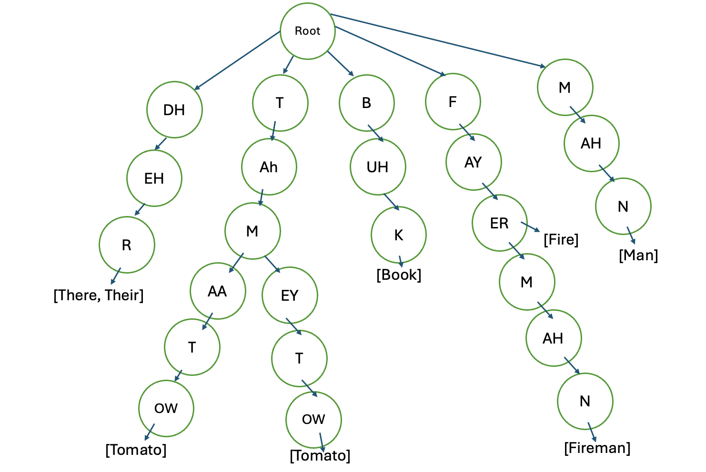

### Step 1: Convert the Word Dictionary to a Prefix Trie
To solve the problem, the first step is to convert the given word dictionary into a **prefix trie**. 
This structure allows us to efficiently search for words that start with a given sequence of phonemes. Trie is 
also space efficient as it shares common prefixes among words and in the worst case it will require as much
space as the original dictionary.

Each **end node** of the trie stores a **list of words** corresponding to that phoneme sequence. For example:
- If the phoneme sequence `['DH', 'EH', 'R']` corresponds to "THEIR" and "THERE," the node at the end of that path will
contain the list `["THEIR", "THERE"]`.

  

### Step 2: Use a Recursive Function to Find Word Combinations
Once the trie is constructed, we use a **recursive function** and trie functions to find all possible combinations of words that can be 
formed by the given sequence of phonemes.

### Recursive Search Logic
1. **Search for Matching Phonemes**:
   - Start at the root of the trie and traverse down a path that matches the sequence of phonemes.
   - If a sequence of phonemes matches a path in the trie, check if it ends at a node containing valid words.
   
2. **Process Remaining Phonemes**:
   - After finding a valid word, recursively search for words using the remaining phonemes.
   - Continue this process until all phonemes are used or no valid combinations remain. 
3. **Return Results**:
   - Combine the valid words found at each step to form all possible combinations of words.

**Base Case**:
   - If all phonemes are successfully used to form words, return the current combination.
   - If it is not possible to use all phonemes (e.g., a sequence does not match any path in the trie), return an empty list.
