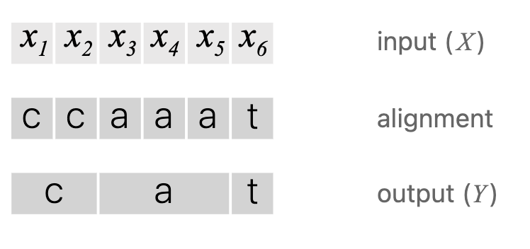
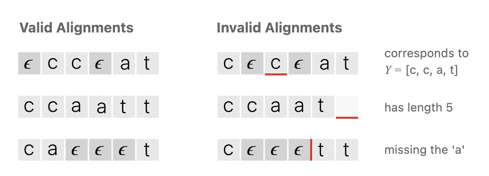
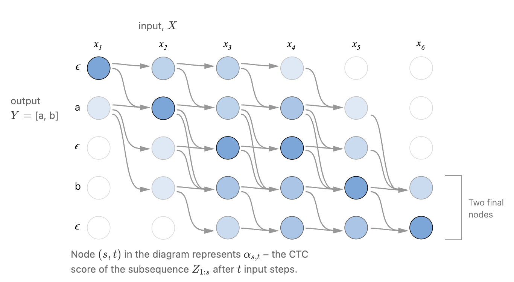

# Connectionist Temporal Classification (CTC)

## Overview

Connectionist Temporal Classification (CTC) is a method used in sequence-to-sequence tasks where the input and output sequences have **different lengths**. It is particularly effective for tasks where the alignment between the input and output is unknown, such as speech-to-text, handwriting recognition, or other time-series-to-symbol problems.

CTC calculates the probability of having a character from the alphabet or a blank token at each timestep from a neural network model. A recurrent neural network (RNN) is a good choice for the model since it considers the sequential nature of the input data. Then, it calculates the probability of the target sequence by summing over all possible alignments. This enables the model to focus on finding the **most probable path** that extends a character or blank token in order to align the input with the target.

  

---

## Algorithm Steps

1. **RNN Output**:  
   The neural network produces raw logits, which are converted into probabilities using a softmax function. For simplicity in our implementation, only the probabilities for label characters are computed since only they are used in forward and backward algorithms. We avoid generating probabilities for all possible characters. Note that in the code, softmax probabilities are used for RNN outputs, and log probabilities are used in recursive algorithms to prevent numerical issues such as underflow.

2. **Blank Token**:  
   CTC introduces a special blank token that represents the absence of output at a timestep. This allows the model to match labels to input frames without requiring a one-to-one alignment between input and output sequences.  
   - **Example**: For the target sequence `cat`, a valid alignment might look like `[c, blank, a, blank, blank, t, blank]`. This is referred to as the extended label.

  

3. **Most Probable Path**:  
   During training, the model examines all paths that collapse into the target sequence `cat` by removing blank tokens and repeated characters. Note that for a repeated character, a blank token must separate them in the alignment to count as two distinct values. The most likely path is the one with the highest probability. The conditional probability of a given labeling is defined as the sum of the probabilities of all paths corresponding to it.

   The probability of the target sequence $Y$ given the input sequence $X$ is calculated as:

$$
P(Y \mid X) = \sum_{\pi \in \mathcal{B}^{-1}(Y)} P(\pi \mid X),
$$

   where:
   - $Y$: The target sequence (e.g., "cat").
   - $\mathcal{B}^{-1}(Y)$: The set of all valid alignments $\pi$ that collapse to $Y$ using the CTC decoding function $\mathcal{B}$. These alignments include blank tokens and repeated characters.
   - $P(\pi \mid X)$: The probability of a specific alignment $\pi$ given the input sequence $X$.

  

---

## Forward Algorithm

The **forward algorithm** computes the total probability of all paths through the extended label sequence up to a given timestep recursively. The forward variable, denoted as $ \alpha(t, s)$, represents the probability of being at state $s$ of the extended sequence at time $t$. This ensures that all valid transitions from the current state to the next are considered.

1. **Initialization**:  
   The algorithm starts with the blank token or the first label, as no paths exist before the first character of the sequence:

$$
\alpha(0, 0) = P(x_0 = \text{blank}),
$$

$$
\alpha(0, 1) = P(x_0 = \text{first label}),
$$

2. **Recurrence**:  
   At each timestep, $\alpha(t, s)$ is computed by summing the probabilities of transitioning from all valid previous states to the current state. This includes:  
   - Staying in the same state.  
   - Transitioning to the next label.  
   - Skipping over the blank token if the current state and the previous state emit different labels.  

$$
\alpha(t, s) = P(x_t = \text{label at } s) \cdot \Big(
    \alpha(t-1, s) +
    \alpha(t-1, s-1) +
    \alpha(t-1, s-2) \text{ (if valid)}
\Big).
$$

3. **Final Probability**:  
   The forward algorithm ends by summing the probabilities of reaching the final states of the extended sequence:

$$
P(Y \mid X) = \alpha(T-1, S-1) + \alpha(T-1, S-2),
$$

   where $S$ is the length of the extended label sequence.

4. **Use in Training**:  
   The CTC loss is the negative log probability of the target sequence given the input:

$$
\text{CTC Loss} = -\log\bigl(P(Y \mid X)\bigr).
$$

---

## Backward Algorithm

The **backward algorithm** computes the total probability of completing the sequence from a given state at a given timestep. The backward variable, denoted as $ \beta(t, s)$, represents the probability of completing the target sequence starting from state $s$ at time $t$.

1. **Initialization**:  
   At the last timestep $t = T-1$:

$$
\beta(T-1, S-1) = P(x_{T-1} = \text{last label}),
$$

$$
\beta(T-1, S-2) = P(x_{T-1} = \text{second-to-last label}),
$$

   and all other states are initialized to $0$.

2. **Recurrence**:  
   At each timestep $t < T-1$, $\beta(t, s)$ is computed by summing the probabilities of transitioning from the current state to all valid next states:

$$
\beta(t, s) = P(x_t = \text{label at } s) \cdot \Big(
   \beta(t+1, s) +
   \beta(t+1, s+1) +
   \beta(t+1, s+2) \text{ (if valid)}
\Big).
$$

3. **Use in Training**:  
   The backward probabilities are combined with forward probabilities to compute **posteriors** at each timestep, which are crucial for evaluating the gradient of the CTC loss:

$$
\text{Posterior}(t, s) = \frac{\alpha(t, s) \cdot \beta(t, s)}{P(Y \mid X)}.
$$

---

## Gradients and Training

1. **Gradient Computation**:  
   The gradient of the CTC loss with respect to the network’s predicted probabilities $P(x_t = v)$ is given by:

$$
\frac{\partial \text{Loss}}{\partial P(x_t = v)} 
 = P(x_t = v) 
   - \sum_{s \in \text{States}(v)} \text{Posterior}(t, s),
$$

   where $\text{States}(v)$ refers to all states in the extended label sequence that emit the symbol $v$.

2. **Gradient Updates**:  
   The gradient of the loss is computed and used to update the network parameters, improving alignment and predictions over time.

---

## References

- [Distill: Connectionist Temporal Classification (CTC)](https://distill.pub/2017/ctc/)  
  This page provides an excellent interactive explanation of CTC and its algorithms. A picture from this page was captured and included for this report.
